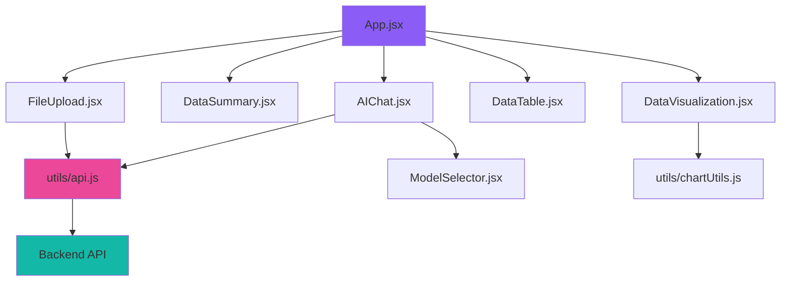

# Frontend Components Documentation

This document provides a detailed overview of all React components in the Data Analyzer AI frontend application.

## 📁 Project Structure

```
src/
├── 📄 App.jsx                    # Main application component
├── 📄 main.jsx                   # React entry point  
├── 📄 index.css                  # Global styles and Tailwind CSS
├── 📁 components/                # Reusable UI components
│   ├── 📄 AIChat.jsx            # AI chat interface
│   ├── 📄 DataSummary.jsx       # Data statistics display
│   ├── 📄 DataTable.jsx         # Interactive data table
│   ├── 📄 DataVisualization.jsx # Chart components
│   ├── 📄 FileUpload.jsx        # File upload interface
│   ├── 📄 ModelSelector.jsx     # AI model selection dropdown
│   └── 📄 Navbar.jsx            # Navigation header
└── 📁 utils/                     # Utility functions
    ├── 📄 api.js                # API communication utilities
    └── 📄 chartUtils.js         # Chart helper functions
```

## 🎨 Core Components

### 🏠 App.jsx
**Main application component that orchestrates the entire frontend**

**Key Features:**
- **State Management**: Manages global application state
- **Component Composition**: Renders all major components
- **Error Handling**: Displays error messages and loading states
- **Data Flow**: Coordinates data flow between components

**State Variables:**
```javascript
const [fileData, setFileData] = useState(null);           // Parsed CSV/Excel data
const [fileStats, setFileStats] = useState(null);        // Statistical summary
const [visualizations, setVisualizations] = useState([]); // Chart configurations
const [isLoading, setIsLoading] = useState(false);       // Loading state
const [error, setError] = useState(null);                // Error messages
```

**Layout Structure:**
- Navigation bar (sticky header)
- File upload section
- Error display (conditional)
- Loading spinner (conditional)
- Main content grid (when data is loaded)
- Empty state (when no data)

---

### 📁 FileUpload.jsx
**Drag-and-drop file upload component with progress tracking**

**Key Features:**
- **Drag & Drop**: Uses `react-dropzone` for intuitive file upload
- **File Validation**: Checks file type (CSV, XLS, XLSX) and size (max 10MB)
- **Progress Tracking**: Visual progress bar during upload
- **Error Handling**: Displays upload errors with clear messages

**Dependencies:**
```javascript
import { useDropzone } from 'react-dropzone';
import { uploadFile } from '../utils/api';
```

**Supported File Types:**
- `.csv` (Comma-separated values)
- `.xlsx` (Excel 2007+)
- `.xls` (Excel legacy)

**Props:**
- `onUploadSuccess`: Callback for successful uploads
- `onUploadError`: Callback for upload errors
- `setIsLoading`: Function to update loading state

---

### 📊 DataSummary.jsx
**Displays comprehensive statistics about the uploaded dataset**

**Key Features:**
- **File Information**: Name, size, last modified date
- **Dataset Structure**: Row count, column count, missing values
- **Data Quality**: Duplicate rows, column types distribution
- **Correlation Matrix**: Shows relationships between numeric columns

**Information Sections:**
1. **File Information**
   - File name and type badge
   - File size in human-readable format
   - Last modified timestamp

2. **Dataset Structure**
   - Total number of rows and columns
   - Missing values count
   - Duplicate rows detection

3. **Column Types**
   - Numeric columns count
   - Categorical columns count
   - DateTime columns count

4. **Correlations** (if available)
   - Correlation matrix for numeric data
   - Highlighted strong correlations

**Props:**
- `stats`: Object containing all statistical information

---

### 📊 DataVisualization.jsx
**Interactive chart component supporting multiple visualization types**

**Key Features:**
- **Multiple Chart Types**: Bar, Line, Pie, Scatter, Area charts
- **Interactive Elements**: Tooltips, legends, hover effects
- **Responsive Design**: Charts adapt to container size
- **Chart Filtering**: Tab-based filtering by chart type
- **Custom Styling**: Consistent color schemes and themes

**Chart Types:**
1. **Bar Charts**: For categorical data comparison
2. **Line Charts**: For trend analysis over time
3. **Pie Charts**: For proportion visualization
4. **Scatter Plots**: For correlation analysis
5. **Area Charts**: For cumulative data visualization

**Dependencies:**
```javascript
import {
  BarChart, Bar, LineChart, Line, PieChart, Pie,
  ScatterChart, Scatter, AreaChart, Area,
  XAxis, YAxis, CartesianGrid, Tooltip, Legend,
  ResponsiveContainer, Cell
} from "recharts";
```

**Props:**
- `visualizations`: Array of chart configuration objects

**Chart Configuration Object:**
```javascript
{
  chart_type: 'bar',           // Chart type
  title: 'Chart Title',       // Display title
  data: [...],                // Chart data
  x_axis: 'column_name',      // X-axis data key
  y_axis: 'value_column'      // Y-axis data key
}
```

---

### 📋 DataTable.jsx
**Advanced data table with sorting, filtering, and pagination**

**Key Features:**
- **Advanced Pagination**: Customizable rows per page (5-100)
- **Column Sorting**: Click headers to sort ascending/descending
- **Global Search**: Search across all columns simultaneously
- **Column Filtering**: Individual filters for each column
- **Performance Optimized**: Efficient rendering for large datasets
- **Responsive Design**: Horizontal scrolling on mobile devices

**Table Features:**
1. **Sorting**
   - Click column headers to sort
   - Visual indicators for sort direction
   - Supports numeric and text sorting

2. **Filtering**
   - Global search bar
   - Individual column filters
   - Real-time filter application
   - Clear all filters button

3. **Pagination**
   - First, Previous, Next, Last buttons
   - Page number navigation
   - Rows per page selector
   - Total results display

**State Management:**
```javascript
const [currentPage, setCurrentPage] = useState(1);
const [rowsPerPage, setRowsPerPage] = useState(10);
const [sortConfig, setSortConfig] = useState({
  key: null,
  direction: 'ascending'
});
const [filters, setFilters] = useState({});
const [searchTerm, setSearchTerm] = useState('');
```

**Props:**
- `data`: Array of data objects to display

---

### 🤖 AIChat.jsx
**AI-powered chat interface for natural language data queries**

**Key Features:**
- **Natural Language Processing**: Ask questions in plain English
- **Multiple AI Models**: Support for various OpenRouter models
- **Contextual Responses**: AI understands your data context
- **Suggested Questions**: Pre-built question templates
- **Chat History**: Maintains conversation context
- **Auto-scrolling**: Automatic scroll to latest messages

**AI Models Supported:**
- Meta Llama models
- Nvidia Nemotron models  
- Qwen models
- GPT models (via OpenRouter)

**Chat Features:**
1. **Message Types**
   - User messages (right-aligned, purple background)
   - AI responses (left-aligned, gray background)
   - Loading indicators with animated dots

2. **Input Features**
   - Auto-resizing textarea
   - Send button with keyboard shortcut (Enter)
   - Disabled state during AI processing

3. **Suggested Questions**
   - Clickable question buttons
   - Context-aware suggestions
   - Common data analysis queries

**Dependencies:**
```javascript
import ModelSelector from "./ModelSelector";
import { askAI } from "../utils/api";
```

**Props:**
- `fileData`: The uploaded dataset
- `fileStats`: Statistical summary for context

---

### 🔽 ModelSelector.jsx
**Dropdown component for selecting AI models**

**Key Features:**
- **Model Selection**: Choose from available AI models
- **Provider Information**: Shows model provider and description
- **Dropdown Interface**: Click-to-open dropdown menu
- **Outside Click Detection**: Closes dropdown when clicking elsewhere

**Available Models:**
```javascript
const models = [
  {
    id: 'meta-llama/llama-3.3-8b-instruct:free',
    name: 'Llama',
    provider: 'Meta',
    description: 'Fast reasoning capabilities'
  },
  {
    id: 'nvidia/llama-3.3-nemotron-super-49b-v1:free',
    name: 'Llama-3.3',
    provider: 'Nvidia', 
    description: 'Quick responses with good quality'
  },
  {
    id: 'qwen/qwen3-30b-a3b:free',
    name: 'Qwen3-0',
    provider: 'Qwen',
    description: 'Fast and cost-effective'
  }
];
```

**Props:**
- `selectedModel`: Currently selected model ID
- `setSelectedModel`: Function to update selected model

---

### 🧭 Navbar.jsx
**Application navigation header**

**Key Features:**
- **Sticky Navigation**: Remains at top when scrolling
- **Brand Identity**: Logo and application name
- **Responsive Design**: Adapts to different screen sizes
- **Consistent Styling**: Matches application color scheme

**Visual Elements:**
- Custom cube icon (SVG)
- "Data Analyzer AI" brand text
- Dark theme with violet accent colors
- Border bottom for visual separation

---

## 🛠️ Utility Functions

### 🔌 utils/api.js
**API communication utilities for backend integration**

**Key Functions:**

1. **`uploadFile(formData, onProgress)`**
   - Uploads files with progress tracking
   - Uses XMLHttpRequest for progress callbacks
   - Returns promise with processed data

2. **`askAI(question, model, context)`**
   - Sends questions to AI models
   - Includes data context for better responses
   - Handles API errors gracefully

3. **`handleResponse(response)`**
   - Consistent error handling
   - Parses JSON responses
   - Creates meaningful error messages

**Configuration:**
```javascript
const API_BASE_URL = '/api';  // Proxied to backend
```

---

### 📊 utils/chartUtils.js
**Chart utility functions for data visualization**

**Key Functions:**

1. **`generateChartColors(count, baseColor)`**
   - Creates color arrays for charts
   - Generates variations of base color
   - Fallback to predefined palette
   - Ensures visual consistency

**Color Generation:**
- Base color: `#8b5cf6` (violet)
- Luminance variations for multiple colors
- Predefined palette for fallback
- Accessibility-conscious color choices

---

## 🎨 Styling & Theming

### Global Styles (index.css)
**Consistent styling across the application**

**Key Style Classes:**

1. **Button Styles**
   ```css
   .btn-primary        /* Primary action buttons */
   .btn-secondary      /* Secondary action buttons */
   ```

2. **Card Styles**
   ```css
   .card              /* Main content containers */
   .chart-container   /* Chart wrapper styling */
   ```

3. **Input Styles**
   ```css
   .input             /* Form inputs and textareas */
   ```

4. **Badge Styles**
   ```css
   .badge             /* Status indicators */
   .badge-violet      /* Violet-themed badges */
   ```

5. **Custom Scrollbars**
   ```css
   .custom-scrollbar  /* Enhanced scrollbar styling */
   ```

**Color Scheme:**
- Primary: Violet (`#8b5cf6`)
- Background: Dark gray (`#1a202c`)
- Cards: Medium gray (`#2d3748`)
- Text: Light gray (`#edf2f7`)
- Accents: Various violet shades

---

## 🔄 Data Flow

### Component Communication Pattern



### State Management Flow

1. **File Upload**: `FileUpload` → `App` → Backend → `App` state update
2. **Data Display**: `App` state → Props → Child components
3. **AI Chat**: `AIChat` → `ModelSelector` → API → Response display
4. **User Interactions**: Child components → `App` state updates

---

## 🧪 Testing Considerations

### Component Testing
- **Props validation**: Test with various prop combinations
- **State changes**: Verify state updates correctly
- **User interactions**: Test clicks, inputs, and form submissions
- **Error states**: Test error handling and display

### Integration Testing
- **API communication**: Mock API responses
- **Data flow**: Test data passing between components
- **File upload**: Test upload process and validation
- **Chart rendering**: Verify charts render with data

### Performance Testing
- **Large datasets**: Test with substantial data volumes
- **Memory usage**: Monitor memory consumption
- **Render times**: Measure component render performance
- **User experience**: Ensure smooth interactions

---

## 🚀 Future Enhancements

### Planned Features
- **Real-time collaboration**: Multi-user data analysis
- **Advanced charts**: More visualization types
- **Data export**: Download processed data
- **Saved sessions**: Persist analysis sessions
- **Custom themes**: User-configurable color schemes

### Technical Improvements
- **TypeScript migration**: Add type safety
- **Testing framework**: Comprehensive test suite
- **Performance optimization**: Code splitting and lazy loading
- **Accessibility**: Enhanced screen reader support
- **PWA features**: Offline functionality

---

This documentation provides a comprehensive overview of the frontend architecture and components. Each component is designed to be modular, reusable, and maintainable, following React best practices and modern web development standards.
