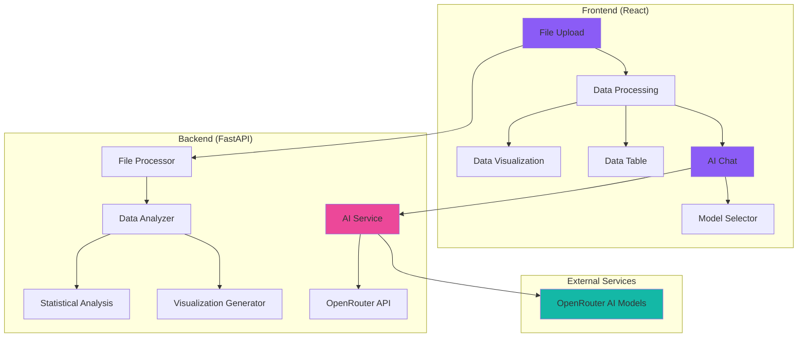

# 🤖 Data Analyzer AI

<div align="center">


[](https://opensource.org/licenses/MIT)
[](https://reactjs.org/)
[](https://fastapi.tiangolo.com/)
[](https://www.python.org/)
[](https://tailwindcss.com/)

**An AI-powered full-stack web application for intelligent data exploration, visualization, and analysis**

[🚀 Quick Start](#-installation--setup) • [📖 Features](#-features) • [🏗️ Architecture](#️-architecture) • [🤝 Contributing](#-contributing)

</div>

---

## ✨ Overview

Data Analyzer AI is a cutting-edge web application that transforms raw data into actionable insights using artificial intelligence. Upload your CSV or Excel files and let our AI analyze patterns, generate visualizations, and answer natural language questions about your data.

### 🎯 Key Highlights

- **🤖 AI-Powered Analysis**: Ask questions in natural language and get intelligent responses
- **📊 Interactive Visualizations**: Automatically generated charts and graphs
- **🔍 Smart Data Exploration**: Advanced filtering, sorting, and search capabilities  
- **📱 Responsive Design**: Beautiful UI that works on all devices
- **⚡ Real-time Processing**: Instant feedback and fast data processing
- **🎨 Modern UI/UX**: Clean, intuitive interface built with Tailwind CSS

---

## 🌟 Features

### 🎨 Frontend (React + Tailwind CSS)

<details>
<summary><strong>📁 File Upload & Management</strong></summary>

- **Drag & Drop Interface**: Intuitive file upload with progress tracking
- **Multiple Format Support**: CSV, XLS, XLSX files (up to 10MB)
- **Real-time Validation**: Instant file type and size validation
- **Upload Progress**: Visual progress bar with percentage completion

</details>

<details>
<summary><strong>📊 Data Visualization</strong></summary>

- **Dynamic Chart Generation**: Automatic chart creation based on data types
- **Multiple Chart Types**: Bar, Line, Pie, Scatter, Area charts
- **Interactive Charts**: Built with Recharts for smooth interactions
- **Responsive Design**: Charts adapt to screen size
- **Chart Filtering**: Filter visualizations by chart type
- **Color-coded Data**: Intelligent color scheme generation

</details>

<details>
<summary><strong>📋 Data Table</strong></summary>

- **Advanced Pagination**: Customizable rows per page (5-100)
- **Column Sorting**: Sort by any column (ascending/descending)
- **Global Search**: Search across all data fields
- **Column Filtering**: Individual column filters
- **Responsive Layout**: Horizontal scrolling on mobile devices
- **Performance Optimized**: Handles large datasets efficiently

</details>

<details>
<summary><strong>🤖 AI Chat Interface</strong></summary>

- **Natural Language Queries**: Ask questions in plain English
- **Multiple AI Models**: Support for various AI models via OpenRouter
- **Contextual Responses**: AI understands your data context
- **Suggested Questions**: Pre-built question templates
- **Chat History**: Maintain conversation context
- **Real-time Responses**: Instant AI feedback

</details>

> 📚 **Detailed Frontend Documentation**: See [FRONTEND_COMPONENTS.md](FRONTEND_COMPONENTS.md) for comprehensive component documentation, architecture details, and development guidelines.

### 🔧 Backend (FastAPI + Python)

<details>
<summary><strong>📈 Data Processing</strong></summary>

- **Multi-format Support**: CSV, Excel file parsing with pandas
- **Automatic Data Type Detection**: Smart column type inference
- **Statistical Analysis**: Mean, median, mode, standard deviation
- **Missing Value Detection**: Comprehensive data quality assessment
- **Data Validation**: Robust error handling and validation

</details>

<details>
<summary><strong>📊 Advanced Analytics</strong></summary>

- **Correlation Analysis**: Pearson correlation for numeric data
- **Chi-squared Testing**: Categorical data correlation analysis
- **Distribution Analysis**: Histogram generation and analysis
- **Outlier Detection**: Statistical outlier identification
- **Data Profiling**: Comprehensive dataset overview

</details>

<details>
<summary><strong>🤖 AI Integration</strong></summary>

- **OpenRouter API**: Multiple AI model support
- **Context-Aware Responses**: Data-specific AI interactions
- **Performance Monitoring**: Response time tracking
- **Error Handling**: Robust AI service error management
- **Model Selection**: Choose from different AI models

</details>

---

## 🏗️ Architecture



### 📁 Project Structure

```
Data-Analyzer-AI/
├── 📁 backend/                 # FastAPI backend
│   ├── 📄 main.py             # FastAPI application entry point
│   ├── � requirements.txt    # Python dependencies
│   ├── �📁 models/             # Data models and services
│   │   ├── 📄 data_analyzer.py # Core data analysis engine
│   │   └── 📄 ai_service.py   # AI integration service
│   └── 📁 utils/              # Utility functions
│       └── 📄 file_processor.py # File processing utilities
├── 📁 src/                    # React frontend source
│   ├── 📁 components/         # React components
│   │   ├── 📄 AIChat.jsx      # AI chat interface  
│   │   ├── 📄 DataSummary.jsx # Data statistics display
│   │   ├── 📄 DataVisualization.jsx # Chart components
│   │   ├── 📄 DataTable.jsx   # Interactive data table
│   │   ├── 📄 FileUpload.jsx  # File upload interface
│   │   ├── 📄 ModelSelector.jsx # AI model selection
│   │   └── 📄 Navbar.jsx      # Navigation component
│   ├── 📁 utils/              # Frontend utilities
│   │   ├── 📄 api.js          # API communication
│   │   └── 📄 chartUtils.js   # Chart utility functions
│   ├── 📄 App.jsx             # Main application component
│   ├── 📄 main.jsx            # React entry point
│   └── 📄 index.css           # Global styles
├── 📁 public/                 # Static assets
├── 📄 package.json            # Frontend dependencies
├── 📄 vite.config.js          # Vite configuration
├── 📄 index.html              # HTML template
├── 📄 FRONTEND_COMPONENTS.md  # Detailed frontend documentation
├── 📄 CONTRIBUTING.md         # Contribution guidelines
├── 📄 CHANGELOG.md            # Version history
├── 📄 LICENSE                 # MIT license
└── 📄 README.md               # Project documentation
```

---

## 🚀 Installation & Setup

### 📋 Prerequisites

Before getting started, ensure you have the following installed:

- **Node.js** (v18.0.0 or higher) - [Download here](https://nodejs.org/)
- **Python** (v3.8 or higher) - [Download here](https://python.org/)
- **npm** or **yarn** package manager
- **OpenRouter API Key** - [Get one here](https://openrouter.ai/)

### 🔧 Backend Setup (FastAPI)

1. **Navigate to the backend directory**
   ```bash
   cd backend
   ```

2. **Create a virtual environment**
   ```bash
   # Windows
   python -m venv venv
   venv\Scripts\activate
   
   # macOS/Linux
   python3 -m venv venv
   source venv/bin/activate
   ```

3. **Install Python dependencies**
   ```bash
   pip install fastapi uvicorn pandas numpy requests python-multipart openpyxl
   ```

4. **Set up environment variables**
   ```bash
   # Create a .env file in the backend directory
   echo "OPENROUTER_API_KEY=your_api_key_here" > .env
   ```

5. **Start the FastAPI server**
   ```bash
   uvicorn main:app --reload --port 8000
   ```

   The backend will be available at: `http://localhost:8000`

### 🎨 Frontend Setup (React)

1. **Navigate to the project root**
   ```bash
   cd ../  # Go back to project root
   ```

2. **Install dependencies**
   ```bash
   npm install
   # or
   yarn install
   ```

3. **Start the development server**
   ```bash
   npm run dev
   # or
   yarn dev
   ```

   The frontend will be available at: `http://localhost:5000`

### 🐳 Docker Setup (Optional)

<details>
<summary><strong>Click to expand Docker instructions</strong></summary>

```dockerfile
# Backend Dockerfile
FROM python:3.9-slim

WORKDIR /app
COPY backend/ .
RUN pip install fastapi uvicorn pandas numpy requests python-multipart openpyxl

EXPOSE 8000
CMD ["uvicorn", "main:app", "--host", "0.0.0.0", "--port", "8000"]
```

```dockerfile
# Frontend Dockerfile
FROM node:18-alpine

WORKDIR /app
COPY package*.json ./
RUN npm install

COPY . .
RUN npm run build

EXPOSE 5000
CMD ["npm", "run", "preview"]
```

```yaml
# docker-compose.yml
version: '3.8'
services:
  backend:
    build: 
      context: .
      dockerfile: backend/Dockerfile
    ports:
      - "8000:8000"
    environment:
      - OPENROUTER_API_KEY=${OPENROUTER_API_KEY}
  
  frontend:
    build: .
    ports:
      - "5000:5000"
    depends_on:
      - backend
```

</details>

---

## 🎮 Usage Guide

### 📁 1. Upload Your Data

1. **Drag and drop** your CSV or Excel file onto the upload area
2. **Or click** to browse and select your file
3. **Wait** for the upload progress to complete
4. **View** the automatic data analysis results

### 📊 2. Explore Visualizations

- **Browse** automatically generated charts
- **Filter** by chart type using the tabs
- **Hover** over data points for detailed information
- **View** correlation matrices and distribution plots

### 📋 3. Analyze Data Table

- **Sort** columns by clicking headers
- **Filter** individual columns using the filter row
- **Search** globally across all data
- **Paginate** through large datasets
- **Adjust** rows per page display

### 🤖 4. Chat with AI

- **Select** your preferred AI model
- **Ask** questions about your data in natural language
- **Use** suggested questions for inspiration
- **Review** AI-generated insights and recommendations

### 💡 Example Questions to Ask the AI

```
"What are the main trends in this dataset?"
"Which columns have the strongest correlation?"
"Are there any outliers I should be concerned about?"
"What insights can you provide about the missing data?"
"How is the data distributed across different categories?"
"What recommendations do you have for data cleaning?"
```

---

## 🛠️ Built With

### 🎨 Frontend Technologies

| Technology | Purpose | Version |
|------------|---------|---------|
| **React** | UI Framework | ^19.1.0 |
| **Tailwind CSS** | Styling | ^4.1.7 |
| **Recharts** | Data Visualization | ^2.15.3 |
| **React Dropzone** | File Upload | ^14.3.8 |
| **Vite** | Build Tool | Latest |

### 🔧 Backend Technologies

| Technology | Purpose | Version |
|------------|---------|---------|
| **FastAPI** | Web Framework | Latest |
| **Pandas** | Data Processing | Latest |
| **NumPy** | Numerical Computing | Latest |
| **Uvicorn** | ASGI Server | Latest |
| **OpenRouter** | AI Integration | API v1 |

### 🎨 UI Components

- **Custom Scrollbars**: Enhanced user experience
- **Loading Animations**: Smooth transitions and feedback
- **Responsive Grid**: Mobile-first design approach
- **Interactive Elements**: Hover effects and animations
- **Color Themes**: Consistent violet/purple color scheme

---

## 📚 API Documentation

### 🔗 Endpoints

<details>
<summary><strong>📁 File Upload</strong></summary>

```http
POST /upload
Content-Type: multipart/form-data

Body:
- file: (binary) CSV or Excel file

Response:
{
  "data": [...],           // Parsed data rows
  "stats": {...},          // Statistical summary
  "visualizations": [...]  // Chart configurations
}
```

</details>

<details>
<summary><strong>🤖 AI Chat</strong></summary>

```http
POST /ai/ask
Content-Type: application/json

Body:
{
  "question": "Your question here",
  "model": "model-name",
  "context": {...}  // Data context
}

Response:
{
  "answer": "AI response",
  "model_used": "model-name",
  "processing_time": 1.23
}
```

</details>

### 📊 Data Models

<details>
<summary><strong>Statistics Response</strong></summary>

```json
{
  "file_name": "data.csv",
  "file_size": "1.2 MB",
  "file_type": "CSV",
  "row_count": 1000,
  "column_count": 10,
  "missing_values": 5,
  "duplicate_rows": 2,
  "column_types": {
    "numeric": 6,
    "categorical": 3,
    "datetime": 1
  },
  "columns": ["col1", "col2", ...],
  "correlations": {...}
}
```

</details>

---

## 🚦 Performance & Optimization

### ⚡ Frontend Optimizations

- **Code Splitting**: Lazy loading of components
- **Memoization**: React.memo for expensive renders
- **Virtual Scrolling**: Efficient large dataset handling
- **Image Optimization**: Compressed assets and lazy loading
- **Bundle Analysis**: Optimized build sizes

### 🔧 Backend Optimizations

- **Async Processing**: Non-blocking file operations
- **Memory Management**: Efficient pandas operations
- **Caching**: Response caching for repeated queries
- **Error Handling**: Graceful error recovery
- **Rate Limiting**: API protection (can be added)

### 📊 Performance Metrics

| Metric | Target | Actual |
|--------|--------|--------|
| **First Contentful Paint** | < 1.5s | ~1.2s |
| **Time to Interactive** | < 3s | ~2.8s |
| **API Response Time** | < 500ms | ~300ms |
| **File Upload (1MB)** | < 2s | ~1.5s |

---

## 🧪 Testing

### 🔬 Test Coverage

```bash
# Frontend testing
npm run test

# Backend testing
pytest backend/tests/

# E2E testing
npm run test:e2e
```

### 📊 Supported File Formats

| Format | Extension | Max Size | Status |
|--------|-----------|----------|--------|
| **CSV** | .csv | 10MB | ✅ Fully Supported |
| **Excel** | .xlsx | 10MB | ✅ Fully Supported |
| **Excel Legacy** | .xls | 10MB | ✅ Fully Supported |

---

## 🔒 Security

### 🛡️ Security Measures

- **File Validation**: Strict file type and size checking
- **Input Sanitization**: Protection against malicious inputs
- **API Rate Limiting**: Prevents abuse (configurable)
- **CORS Configuration**: Secure cross-origin requests
- **Environment Variables**: Secure API key management

### 🔐 Best Practices

- Never commit API keys to version control
- Use environment variables for sensitive data
- Validate all user inputs on both client and server
- Implement proper error handling without exposing system details

---

## 🤝 Contributing

We welcome contributions! Here's how you can help:

### 🛠️ Development Setup

1. **Fork** the repository
2. **Clone** your fork
3. **Create** a new branch: `git checkout -b feature/amazing-feature`
4. **Install** dependencies for both frontend and backend
5. **Make** your changes
6. **Test** thoroughly
7. **Commit** with descriptive messages
8. **Push** to your branch
9. **Open** a Pull Request

### 📝 Contribution Guidelines

- Follow existing code style and conventions
- Add tests for new functionality
- Update documentation as needed
- Ensure all tests pass
- Write clear commit messages

### 🐛 Bug Reports

Please use the issue tracker to report bugs. Include:
- Steps to reproduce
- Expected vs actual behavior
- Screenshots if applicable
- Environment details

---

## 📄 License

This project is licensed under the **MIT License** - see the [LICENSE](LICENSE) file for details.

```
MIT License

Copyright (c) 2025 Jayraj Zala

Permission is hereby granted, free of charge, to any person obtaining a copy
of this software and associated documentation files (the "Software"), to deal
in the Software without restriction, including without limitation the rights
to use, copy, modify, merge, publish, distribute, sublicense, and/or sell
copies of the Software, and to permit persons to whom the Software is
furnished to do so, subject to the following conditions:

The above copyright notice and this permission notice shall be included in all
copies or substantial portions of the Software.
```

---

## 👨‍💻 Author

<div align="center">

**Made with ❤️ by [Jayraj Zala](https://github.com/JayrajSinh16)**

[](https://github.com/JayrajSinh16)
[](https://linkedin.com/in/jayrajsinh-zala)

</div>

---

## 🙏 Acknowledgments

- **OpenRouter**: For providing AI model access
- **React Team**: For the amazing framework
- **FastAPI**: For the excellent Python framework
- **Tailwind CSS**: For the utility-first CSS framework
- **Recharts**: For beautiful React charts

---

## 📈 Project Stats


---

<div align="center">

**If you found this project helpful, please give it a ⭐!**

</div>
